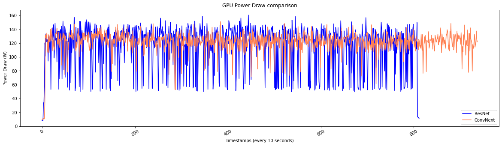

# ConvNeXt vs ResNet: an old vs new classification model comparison based on energy consumption and usability

<p align="center"></p>

This is the final project for the course 'Intro to ANNs using Tensorflow', WiSe 2021/2022. Please read the [Documentation](Documentation\Documentation.md) for more information. The requirements and user-guide can be found on the bottom of this page. 

<br />

## Introduction

As progress goes on, larger and more powerful neural networks are being developed and tested. Among the Convolutional Neural Networks (CNN) for image classification, a recent one presenting major improvements was Meta's [ConvNeXt](https://arxiv.org/abs/1806.07795). This network is based and built on top of the older [ResNet](https://arxiv.org/abs/1512.03385) architecture, and has shown to reach state-of-the-art performance on the ImageNet dataset, even competing with transformers on tasks such as object detection, image segmentation, and classification tasks.

Due to its foundational changes however, even the smallest version of the ConvNeXt, the "ConvNeXt-T" with 28M parameters, seems to be needing a lot more computational power than the predecessor, ResNet. The question now becomes if it is even worth it to train such a large network only to get a small improvement in accuracy for a simple classification task. 

We therefore decided to compare the performance and energy consumption of ConvNeXt and ResNet50 on a real-world dataset.

<br />

## Description

We used the [Bird Species](https://www.kaggle.com/gpiosenka/100-bird-species) dataset to perform classification on both models. A detailed description of our used data can be found in the [Documentation](Documentation\Documentation.md). The images are stored in the `/Data/Use/` folder and are resized to a size of 224x224 pixels. The dataset consists of 400 bird classes and about 120-140 images per class. This brings the training set to a total of 58,388 images.

<br />

In our data pipeline, we use the following preprocessing and augmentation steps via the `tf.keras.preprocessing.image.ImageDataGenerator`:

- rescale (Normalization)
- rotation_range (Random rotation)
- width_shift_range (Random horizontal offset)
- height_shift_range (Random vertical offset)
- shear_range   (Cropping) 
- zoom_range (Random zoom)
- horizontal_flip (Flip horizontally)
- zca_epsilon (ZCA whitening)
- brightness_range  (Random brightness)
- fill_mode='nearest' (Points outside the input are filled according to: aaaaaaaa|abcd|dddddddd)

<br />

We make use of an `nvidia-smi` script, located in `Code/files/gpu_reader.sh` to measure the energy consumption of the GPU while training both models.

<br />

We then evaluate the models on the test set (2000 Images) and finally compare our results to check if using the simpler model would still suffice for our use case: 

| Model | Parameters | Test accuracy | Epochs | Average time per epoch | Energy usage | 
|--------|-----------|--------------|--------|---------------|--------------|
| ResNet-50 | 24,407,312 | 0.87 | 10 | 810 s | ~ 93474.32 W / 21.11 KWh |
| ConvNext-T | 28,127,728 | DNF | 6 | 1881 s | ~ 113903.22 W / 29.68 KWh |

The implemented ResNet-50 had no problems at all and reached a testing accuracy of 87% while only consuming about 21KWh during training. The ConvNeXt however, did not reach a significant accuracy level during training, due to mistakes in the implementation, preprocessing or the fact that it had to have been trained for more than 100 epochs. But even after 6 epochs and 3 hours of training, the network consumed about .. and we decided to stop the training completely. 

<p align="center"></p>

More on this can be found in the following notebook: [gpu_analysis.ipynb](Code/gpu_analysis.ipynb)

## Conclusion

# Requirements

The following packages were used for this project: 

```
pip install -r requirements.txt
```

They can be installed by using: `pip install -r requirements.txt` in the root folder. 
